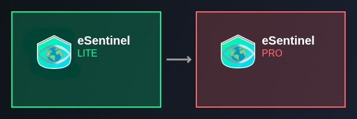

Current work in progress - projected release Q1 2026
_____________________________________

# eSentinel-lite

**A Lightweight VPN-First Firewall Security Framework for Linux**

## System Architecture
[Interactive Architecture](https://opsec-ee.github.io/eSentinel-lite/architecture.html) - Comprehensive system component relationships and data flow analysis.

## License

eSentinel™ Lite is licensed under the Apache License 2.0. See [LICENSE](LICENSE) for the full license text.

This project is open source and free to use, modify, and distribute according to the Apache License terms.

## Trademark

eSentinel™ is a trademark of H.Overman. See [TRADEMARK.md](TRADEMARK.md) for our trademark policy.

The eSentinel name and any logos may not be used in derivative works without explicit permission.

## Commercial Version

eSentinel™ Pro is available with additional enterprise features, commercial support, and licensing options suitable for business use.

For commercial licensing inquiries: **opsec.ee@pm.me**
